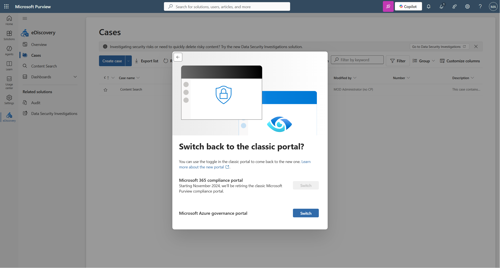
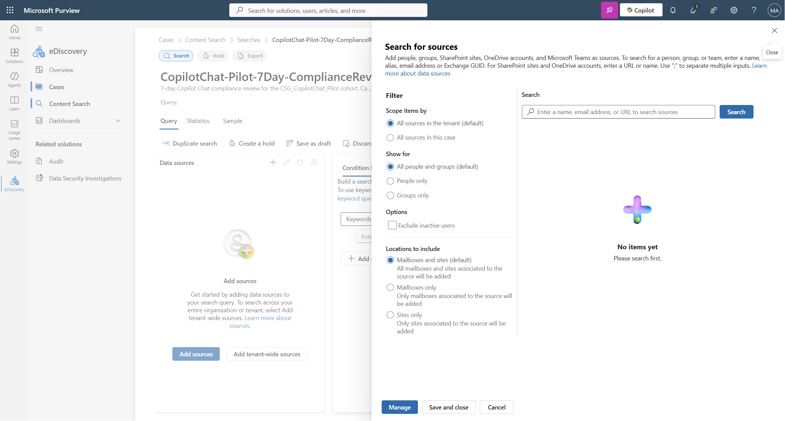
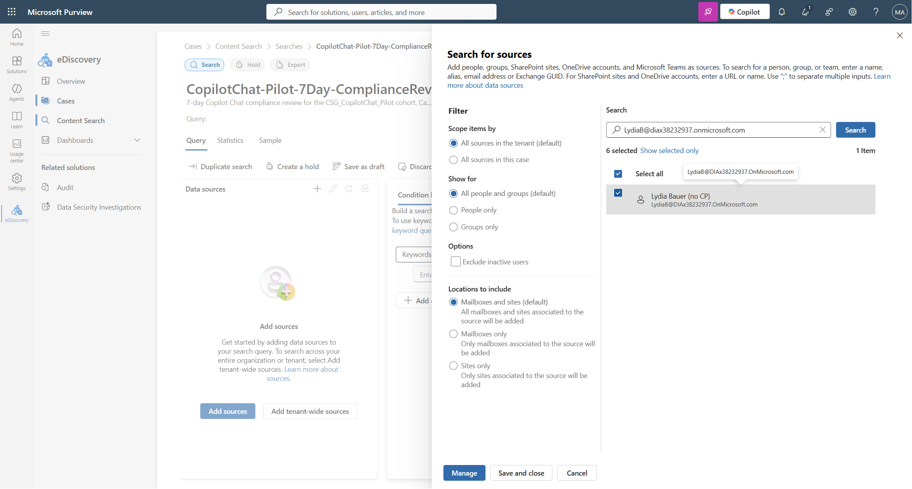
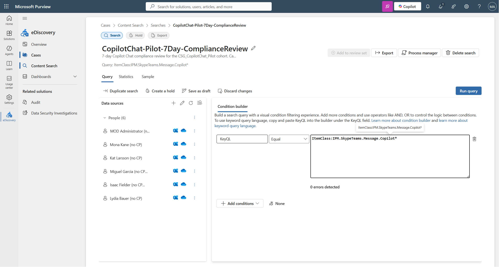
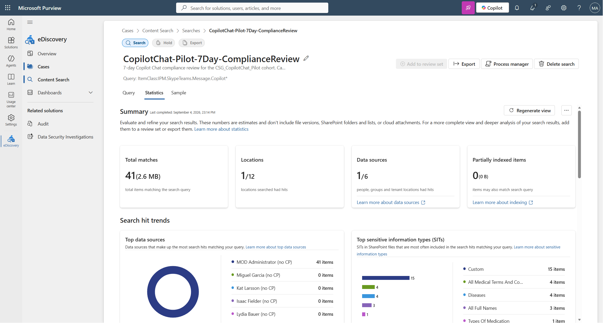
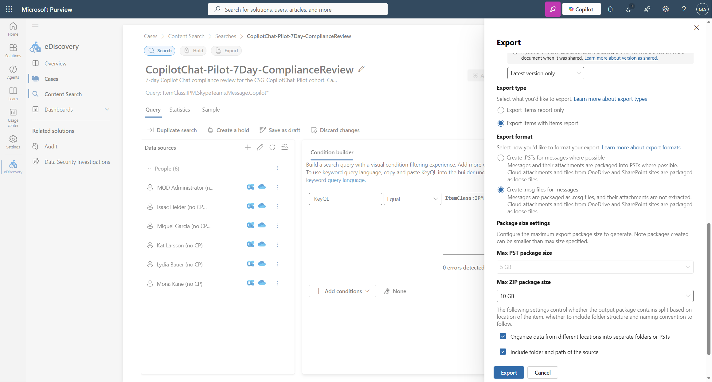
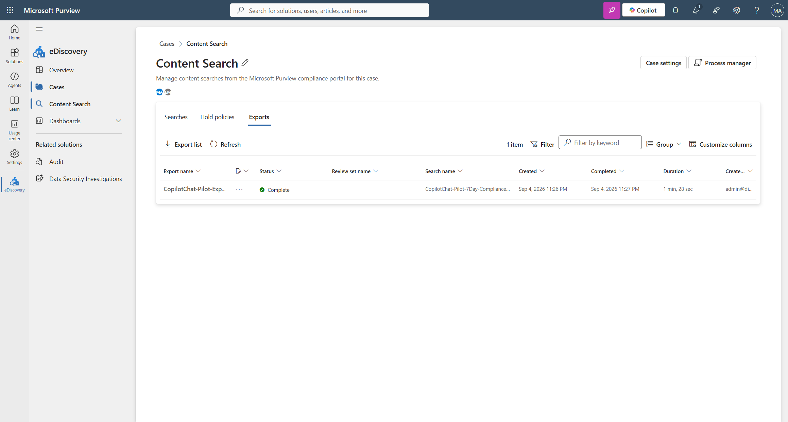
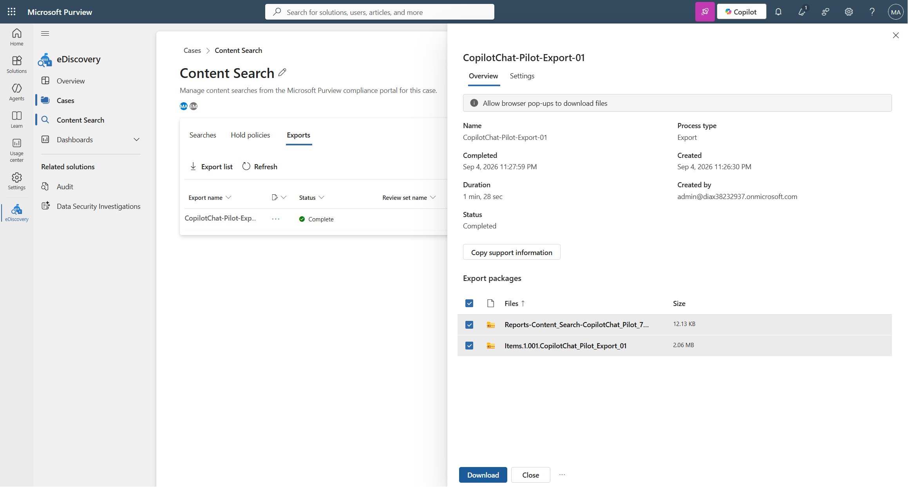

# Copilot Chat Compliance Audit Runbook (eDiscovery **Standard**)

**Objective:** Audit Copilot Chat usage over a pilot window and produce a management-reviewable
report containing the actor, timestamp (Eastern), prompt, response, attachments, web-search
keywords, citations, and Copilot entrypoint.

**Audience:** Microsoft Purview / Exchange Online administrators

**Licensing boundary:** This runbook uses **eDiscovery Standard only**. It does not use, and does
not require, any eDiscovery Premium capability.

---

## Why this version exists

An earlier version of this runbook (in `C:\Scout_Output\CopilotChat-Compliance-Runbook`) instructed
admins to export in a "Native / HTML transcript" format and to supply a Unified Audit Log JSON file
via `-AuditEventsPath`. Both instructions were wrong for Standard customers:

- Conversation-level HTML transcript export is an **eDiscovery Premium** option.
- The audit JSON is unnecessary, because the Copilot entrypoint is already stamped on every
  exported message.

**That folder is superseded. Use this runbook and the v2 script.**

---

## Prerequisites

### Tenant requirements
- **Microsoft Purview eDiscovery (Standard)**
- **Copilot Chat** in use by a pilot group (5–15 users recommended)
- Allow a few hours after user activity for Exchange indexing before searching

### Role requirements
Assign these in **Purview → Settings → Roles and scopes → Role groups**:

| Role group | Why it is needed |
|---|---|
| **eDiscovery Manager** | Create cases, create and run searches, export results |
| **Compliance Administrator** *(or eDiscovery Administrator)* | Manage case access and required for a fresh tenant with no prior eDiscovery setup |

> On a brand-new tenant, the Global Administrator is **not** automatically an eDiscovery Manager.
> Explicitly add the admin account to the **eDiscovery Manager** role group before Phase 1,
> otherwise the eDiscovery blades appear empty.



### Workstation requirements (for the report step)
- Windows with **desktop Outlook installed** (the script reads PSTs through Outlook COM)
- PowerShell 5.1 or PowerShell 7
- Outlook **closed** when the script runs
- Run PowerShell at the same elevation as Outlook (normally: not elevated)

---

## Phase 1: Create the eDiscovery case

1. Open **Microsoft Purview** → **eDiscovery** → **Cases**
2. Select **+ Create case**
3. Name it, for example: `Copilot-Chat-Pilot-Audit-2026-09-06`
4. Select **Create**

---

## Phase 2: Create the Copilot search

### 2a. Validate mailbox identities first

`New-ComplianceSearch` accepts an `-ExchangeLocation` value that does not resolve to a real mailbox.
It does not error and does not warn — that location simply contributes zero items, and the export
completes looking healthy while silently missing a user.

Validate every pilot identity before creating the search:

```powershell
Connect-ExchangeOnline
Connect-IPPSSession

.\Test-ComplianceSearchScope.ps1 -Mailbox `
    'LisaT@contoso.onmicrosoft.com','AmberR@contoso.onmicrosoft.com'
```

Use the resolved primary SMTP addresses verbatim.

### 2b. Create the search and add data sources

1. In the case, open **Search** → **+ New search**
2. Name it, for example: `CopilotChat-2026-09-04-to-2026-09-07`
3. Add each validated pilot user as a data source
4. Do **not** add SharePoint or OneDrive — Copilot Chat messages live in Exchange




### 2c. Set the KeyQL condition

In the **Condition builder**, add a **KeyQL** condition and enter:

```text
ItemClass:IPM.SkypeTeams.Message.Copilot* AND (Sent>=2026-09-04 AND Sent<=2026-09-07)
```



Notes:
- The `Copilot*` wildcard captures both `...Copilot.BizChat` and `...Copilot.WebChat`.
- The date bounds define the audit window. For a 7-day pilot, set the range accordingly.

### 2d. Run and reconcile

1. Select **Run query**
2. Review the **Statistics** tab when it completes



Confirm the item count is non-zero and that **every** scoped mailbox is represented. A pilot user
with zero items is a scope or indexing fault to investigate, not proof of inactivity.

Optionally use the **Sample** tab to spot-check items before exporting.

---

## Phase 3: Export (Standard settings — read carefully)

1. Select **Export**
2. Enter an **export name** — this field is required and the export fails silently without it
3. Configure the options exactly as below

| Setting | Required value |
|---|---|
| Export type | **Export items with items report** |
| Export format | **Create .PSTs for messages where possible** |
| Organize data from different locations into separate folders or PSTs | Checked |
| Include folder and path of the source | Checked |



> **Correction to the screenshot above:** it shows *"Create .msg files for messages"* selected.
> That is **not** what this solution uses. Select **"Create .PSTs for messages where possible"**.

**Do not select these — they are eDiscovery Premium only and are not required:**
- Include full conversation for Copilot, Teams, and Viva Engage messages
- Organize conversations into HTML transcripts
- Convert supported file formats to HTML

4. Select **Export** and wait for it to complete



### 3a. Download and extract

Open the completed export and select **Download**.



A Standard export produces **two packages**:

| Package | Contents |
|---|---|
| `PSTs...zip` | The mailbox PSTs containing the Copilot messages |
| `Reports-...zip` | `Items_*.csv`, `Summary`, `Locations`, `Settings` |

Seeing only PSTs and Reports is **correct and expected** for Standard. The absence of HTML
transcript files is not an error.

Extract both into one folder, for example:

```text
C:\CopilotAudit\Input\
  ├── Exchange\
  │     ├── LisaT@contoso.onmicrosoft.com.001.pst
  │     ├── AmberR@contoso.onmicrosoft.com.001.pst
  │     └── WillB@contoso.onmicrosoft.com.001.pst
  ├── Items_0_<timestamp>.csv        (optional)
  ├── Summary-<timestamp>.csv        (optional)
  ├── Locations-<timestamp>.csv      (optional)
  └── Settings-<timestamp>.csv       (optional)
```

Only the `.pst` files are required. The CSVs are optional metadata enrichment.

---

## Phase 4: Generate the compliance report

1. Close Outlook completely and confirm no process remains:

```powershell
Get-Process OUTLOOK -ErrorAction SilentlyContinue
```

If a process is listed, close it by ID:

```powershell
Stop-Process -Id <ProcessId>
```

2. Run the report script:

```powershell
& 'C:\Scout_Output\917tenantv2\Get-CopilotChatComplianceReport.ps1' `
  -ExportPath   'C:\CopilotAudit\Input' `
  -OutputFolder 'C:\CopilotAudit\Report' `
  -StartUtc ([datetime]'2026-09-04T00:00:00Z') `
  -EndUtc   ([datetime]'2026-09-07T00:00:00Z') `
  -TimeZoneId 'Eastern Standard Time'
```

### Parameters

| Parameter | Required | Purpose |
|---|---|---|
| `-ExportPath` | Yes | Folder containing the extracted PSTs |
| `-OutputFolder` | Yes | Destination for CSV, JSON, and HTML |
| `-StartUtc` | No | Inclusive UTC window start (defaults to 7 days ago) |
| `-EndUtc` | No | Exclusive UTC window end (defaults to now) |
| `-TimeZoneId` | No | Display time zone; use `Eastern Standard Time` |

There is **no** `-AuditEventsPath` parameter. No audit log export is needed.

### Expected console output

```text
Reading PST: LisaT@contoso.onmicrosoft.com.001.pst
  Scanning folder: TeamsMessagesData
    Items in folder: 13
    [1/13] reading item
    ...
  Finished reading: LisaT@contoso.onmicrosoft.com.001.pst
Reading complete. Rows collected: 15
Generated 15 content-bearing row(s).
Detaching PST stores from the Outlook profile (report is already saved).
Done.
```

The CSV, JSON, and HTML are written **before** the store-detach step. If `Detaching PST stores...`
is slow, your report is already complete on disk and Ctrl+C is safe.

---

## Phase 5: Review the report

Open `CopilotChat-ComplianceReport.html`. Columns:

| Column | Source |
|---|---|
| Timestamp | Message received time, converted to the requested time zone (UTC also shown) |
| Actor | Mailbox owner of the source PST |
| Entrypoint | Derived from the message class (see below) |
| Prompt # | The `**prompt N**` label carried by the seeding convention |
| Prompt | The user's prompt text |
| Response | Copilot's answer, decoded from the exported adaptive-card payload |
| Attachments | Files the **user uploaded** into the conversation |
| Grounded files | Tenant files and mail items **Copilot referenced** to answer |
| Web search keywords | Bing terms when Copilot reported them |
| Citations | External web URLs cited in the answer |
| Source PST | Evidence file the row came from |

### Attachments versus grounded files

These are separate columns because they answer different compliance questions.

- **Attachments** are files the user deliberately supplied. In the export these arrive as a message
  whose entire body is a file reference, which is how the script identifies them.
- **Grounded files** are tenant documents or mail items Copilot pulled in on its own, cited inline
  within the answer text. Work-mode prompts commonly produce several.

### A note on citation markers

Microsoft 365 Copilot Chat (Basic) frequently cites sources with inline markers such as
`【1-67b5b2】` and does not include the URL in the exported body. When that happens the
**Web search keywords** column still proves a web search occurred, but **Citations** will be empty.
Treat reported keywords, not citation count, as the reliable web-grounding signal.

### How Entrypoint is determined

| MessageClass in the PST | Entrypoint shown |
|---|---|
| `IPM.SkypeTeams.Message.Copilot.BizChat` | Outlook/Teams BizChat |
| `IPM.SkypeTeams.Message.Copilot.WebChat` | Copilot Chat web |
| Any other Copilot class | Copilot Chat |

This is read directly from the exported message, which is why no audit JSON is required.

---

## Portability to a customer tenant

Phases 1–3 are performed in the customer's Purview tenant by their administrator. Phase 4 requires
**no tenant connectivity at all** — the script runs entirely offline against the extracted export.

To reuse this solution:
1. Give the customer this runbook.
2. Have them create the case, search, and Standard export using the KeyQL condition in Phase 2c,
   adjusting the date bounds to their audit window.
3. Have them extract the packages and run the Phase 4 command against their own paths.

---

## Troubleshooting

### `0x80080005 CO_E_SERVER_EXEC_FAILURE` when starting Outlook COM
Outlook is already running, or is running at a different elevation. Close Outlook fully, verify no
`OUTLOOK.EXE` remains, and run PowerShell non-elevated.

### The script appears to hang after the last item
This is the store-detach step. The report files are already written. Ctrl+C is safe, and the next
run automatically removes any store left behind.

### A pilot user is missing entirely
Their mailbox identity likely did not resolve when the search was created. Re-run
`Test-ComplianceSearchScope.ps1` and recreate the search with the resolved primary SMTP address.

### `No readable Copilot message bodies were found`
The export contains no Copilot message content in the requested window. Verify:
- the search query is populated and returned a non-zero item count
- the export format was **PSTs**, not items-report-only
- `-StartUtc` / `-EndUtc` bracket the activity (both are **UTC**, not local)

The script fails here deliberately rather than emitting blank prompt and response fields.

### Web search keywords are empty
Copilot only reports its Bing terms when the prompt asks for them. Seed prompts with an explicit
instruction such as "list the exact Bing search terms used."

---

## Data handling

Exported content contains real user prompts and responses. Treat the export folder and the
generated report as confidential, store them in an access-controlled location, and delete them when
the review is complete.
