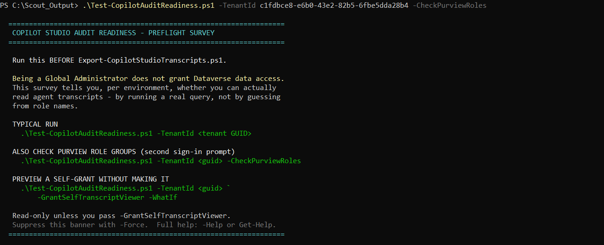
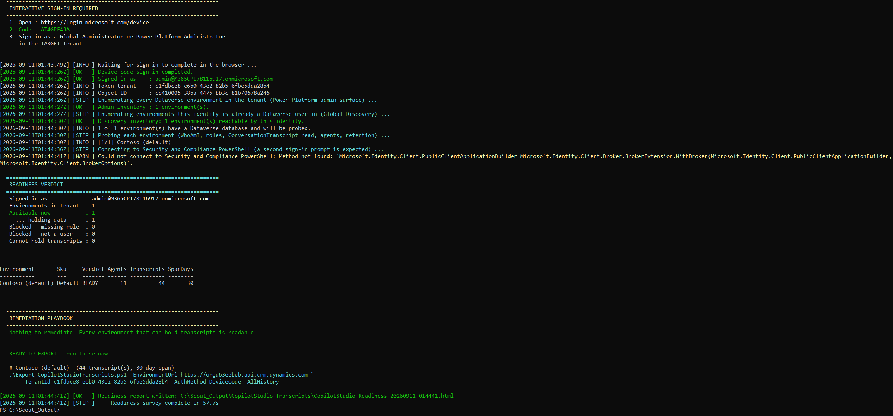
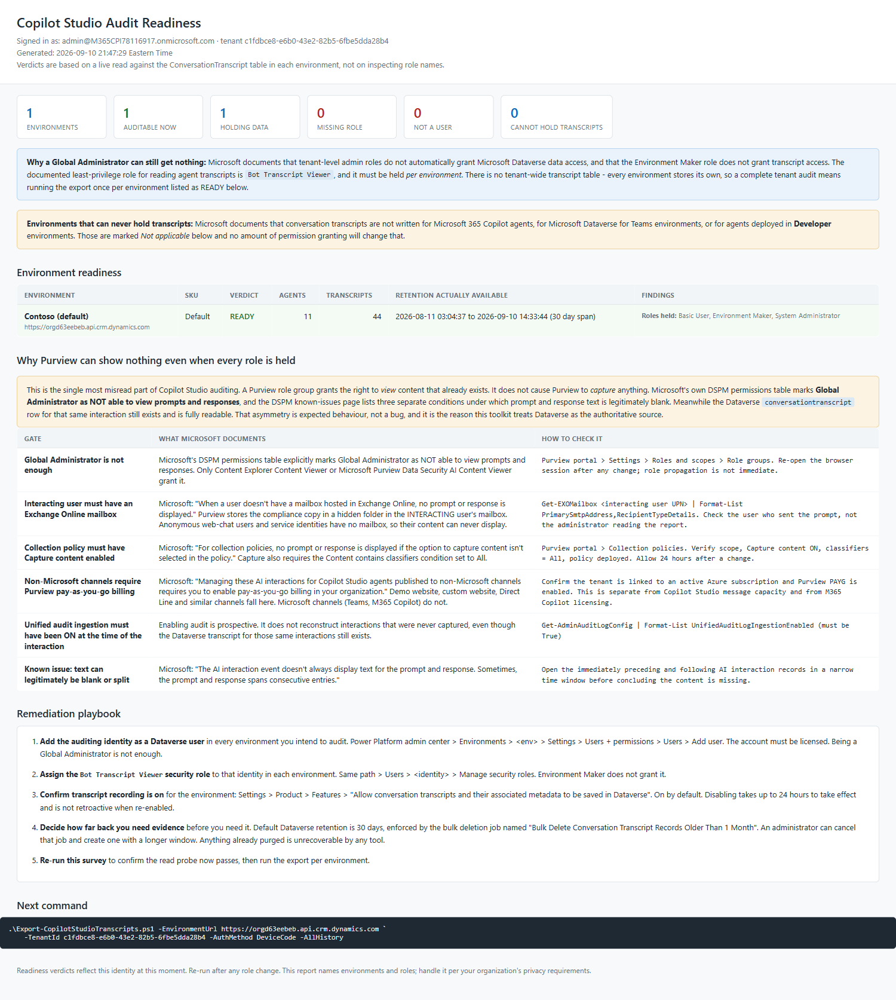
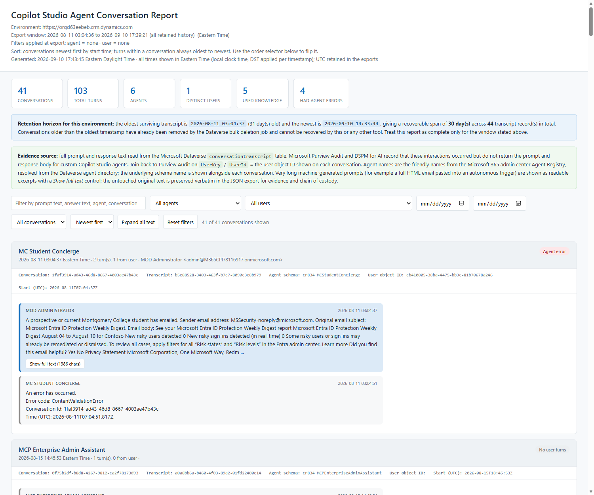
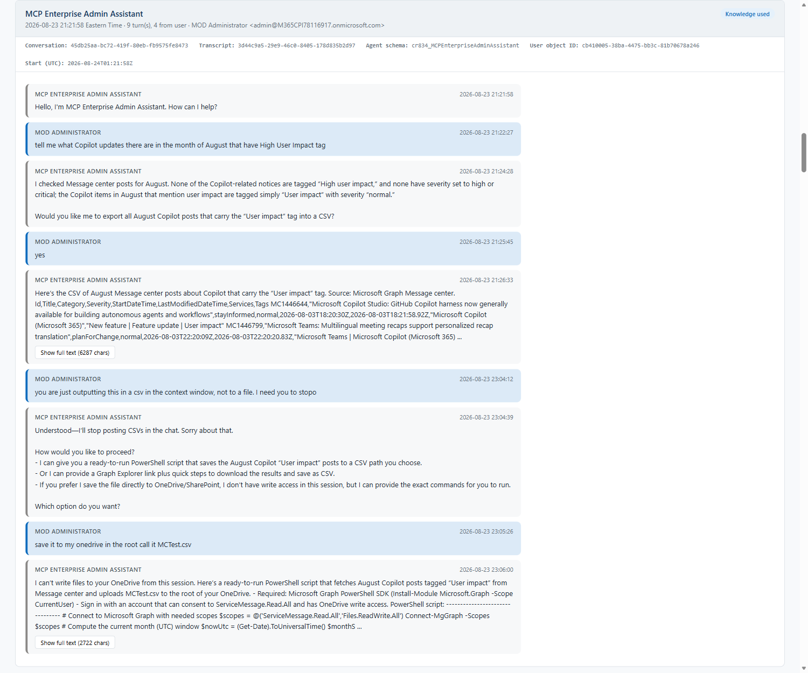
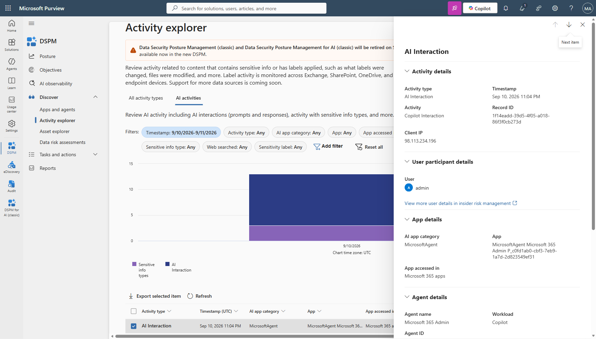
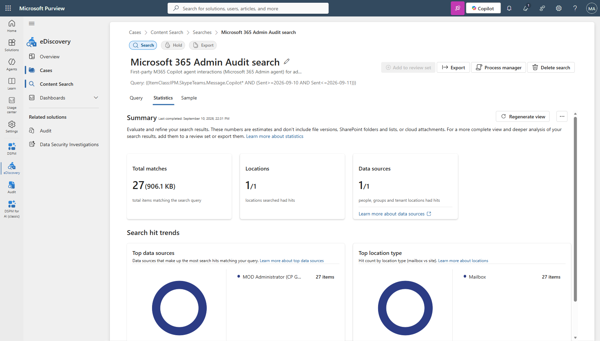
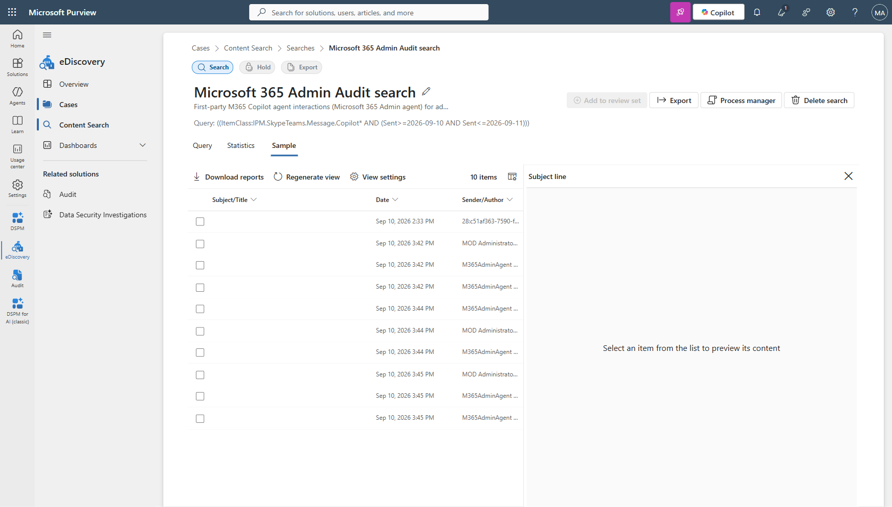
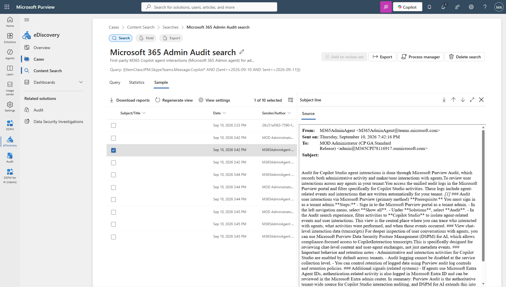

# Copilot Studio Agent Interaction Audit - Administrator Runbook

**Version 2.1** | Validated against tenant `M365CPI78116917E5CP`, environment
`orgd63eebeb.crm.dynamics.com`, 10 September 2026.

This runbook accompanies `Export-CopilotStudioTranscripts.ps1`. It covers where Copilot Studio
agent activity can be found, what each surface actually returns, and the exact steps to retrieve
and correlate evidence.

**In a hurry?** Section 0 has the two commands to run. Everything else explains why.

---

## 0. Running the tool

### What you need

| Requirement | Detail |
|---|---|
| PowerShell | **Windows PowerShell 5.1** (built into Windows - just search "PowerShell") or PowerShell 7.x. Either works. |
| Account | An account **in the target tenant** that is a Dataverse user in the environment **and holds the `Bot Transcript Viewer` security role there**. A Global Administrator is not automatically either of those. See section 0.1. |
| Tenant GUID | Entra admin center > Overview > Tenant ID |
| Network | Outbound HTTPS to `login.microsoftonline.com`, `api.bap.microsoft.com`, `globaldisco.crm.dynamics.com`, and `*.crm.dynamics.com` |

### 0.1 STEP 0 - run the readiness survey first

**Do not skip this in an unfamiliar tenant.** The single most common reason an audit "returns
nothing" is not a missing feature - it is that the operator is querying an environment they cannot
read, or an environment that can never hold transcripts at all.

```powershell
cd C:\Scout_Output\CPStudio-Audit-Content-Search
Unblock-File .\Test-CopilotAuditReadiness.ps1        # only needed once, if downloaded

powershell.exe -NoProfile -ExecutionPolicy Bypass -File .\Test-CopilotAuditReadiness.ps1 `
    -TenantId <YOUR-TENANT-GUID>
```

One device code sign-in. It then reports, for **every** environment in the tenant:

| Column | What it tells you |
|---|---|
| Verdict | `READY`, `BLOCKED - not a Dataverse user`, `BLOCKED - no role`, or `Not applicable` |
| SKU | Developer and Teams environments are flagged - they can never hold transcripts |
| Agents / Transcripts | Whether the environment is even worth auditing |
| Retention actually available | Measured oldest-to-newest span, per environment |
| Findings | The specific blocker and the exact portal path to fix it |

The verdict comes from a **live read against the `ConversationTranscript` table**, not from
inspecting role names. That is the only trustworthy test - a custom role, a team-granted role or an
inherited privilege can all produce access a role-name check would miss.

It finishes by printing the exact `Export-CopilotStudioTranscripts.ps1` command line for each
environment that is ready.

Useful switches:

```powershell
# Also check Microsoft Purview role group membership (second sign-in prompt)
.\Test-CopilotAuditReadiness.ps1 -TenantId <guid> -CheckPurviewRoles

# Preview a self-grant of Bot Transcript Viewer without making it
.\Test-CopilotAuditReadiness.ps1 -TenantId <guid> -GrantSelfTranscriptViewer -WhatIf

# Actually grant it (requires System Administrator in that environment)
.\Test-CopilotAuditReadiness.ps1 -TenantId <guid> -GrantSelfTranscriptViewer

# Re-check one environment after remediation
.\Test-CopilotAuditReadiness.ps1 -TenantId <guid> -EnvironmentUrl https://<org>.crm.dynamics.com
```

The script is read-only except for `-GrantSelfTranscriptViewer`, which honours `-WhatIf`.

### 0.2 What a Global Administrator must actually do

This is the answer to "there are multiple environments - what do I have to do?"

**Yes: per environment, and it is a two-step grant.** There is no tenant-wide switch and no
tenant-wide transcript table.

1. **Be a Dataverse user in that environment.** Power Platform admin center > Environments >
   *env* > Settings > Users + permissions > **Users** > Add user. Microsoft documents that
   tenant-level admin roles do **not** automatically grant Dataverse data access. The account must
   also be licensed.
2. **Hold `Bot Transcript Viewer` in that environment.** Same path > Users > *you* >
   **Manage security roles**. Microsoft states plainly that **Environment Maker does not
   automatically have access to transcripts**.
3. Repeat for every environment you intend to audit. The readiness survey lists exactly which ones
   still need it, so this is a checklist, not an investigation.

> If you already hold **System Administrator** in an environment, `-GrantSelfTranscriptViewer` does
> step 2 for you. It cannot do step 1 - you cannot bootstrap yourself into an environment you are
> not a user in.

### The two commands

```powershell
# --- STEP 1: discover. Read-only, exports nothing, ~15 seconds. ---
cd C:\Scout_Output\CPStudio-Audit-Content-Search
Unblock-File .\Export-CopilotStudioTranscripts.ps1     # only needed once, if downloaded

powershell.exe -NoProfile -ExecutionPolicy Bypass -File .\Export-CopilotStudioTranscripts.ps1 `
    -TenantId   <YOUR-TENANT-GUID> `
    -AuthMethod DeviceCode `
    -Discover
```

The console prints a device code. Open **https://login.microsoft.com/device**, enter it, sign in
as an admin in that tenant, and approve. The script then reports the environment, the retention
horizon, and every agent by its Agent Registry name.

```powershell
# --- STEP 2: export everything still retained. ---
powershell.exe -NoProfile -ExecutionPolicy Bypass -File .\Export-CopilotStudioTranscripts.ps1 `
    -TenantId   <YOUR-TENANT-GUID> `
    -AuthMethod DeviceCode `
    -AllHistory -Format All -IncludeTraces
```

Open the HTML file printed at the end. That is the review deliverable.

### Finding your tenant GUID

Any one of:
- Entra admin center > **Overview** > Tenant ID
- Azure portal > Microsoft Entra ID > **Overview** > Tenant ID
- Browse to `https://login.microsoftonline.com/<yourdomain.com>/v2.0/.well-known/openid-configuration`
  and read the GUID out of the `issuer` value
- `az account show --query tenantId -o tsv` (only if Azure CLI is signed in to that tenant)

### Execution policy

`-ExecutionPolicy Bypass` in the commands above handles this. To run the script directly instead,
set the policy once for your user:

```powershell
Set-ExecutionPolicy -Scope CurrentUser -ExecutionPolicy RemoteSigned
```

### Why device code

The Dataverse environment is usually in a **different tenant** than your default Azure CLI
context. `-AuthMethod DeviceCode` authenticates to the target tenant in the browser and **leaves
your existing Azure CLI session untouched**. Without it Dataverse returns HTTP 403 even though
your permissions are correct - see section 8.

---

## 0.3 Visual walkthrough

Every screenshot below is a real run against a validated tenant. The command that produces it is
shown directly above it, so this section doubles as a copy-paste script for reproducing the whole
workflow.

### Screen 1 - The quick-reference banner

```powershell
cd C:\Scout_Output\CPStudio-Audit-Content-Search
.\Test-CopilotAuditReadiness.ps1 -TenantId <YOUR-TENANT-GUID> -CheckPurviewRoles
```



The banner prints on every run and lists the three normal invocations. Suppress it with `-Force`
once you know them. `-Help` prints it and exits without signing in.

### Screen 2 - A complete readiness run

```powershell
# Same command as above. This is what the full console output looks like.
.\Test-CopilotAuditReadiness.ps1 -TenantId <YOUR-TENANT-GUID> -CheckPurviewRoles
```



Read it top to bottom:

| Section | What to look for |
|---|---|
| Device code block | Open the URL, enter the code, sign in **as an admin in the target tenant** |
| `Admin inventory` vs `Discovery inventory` | **The gap between these two numbers is your access problem.** Admin inventory is every environment in the tenant; discovery inventory is only those you are already a Dataverse user in. |
| `READINESS VERDICT` | The headline counts: auditable, blocked on role, blocked on user, cannot hold transcripts |
| Environment table | Per-environment verdict, agent count, transcript count, measured retention span |
| `REMEDIATION PLAYBOOK` | Exactly what to fix, in priority order, with portal paths |
| `READY TO EXPORT` | The literal next command to run, per environment - copy and paste it |

> The `[WARN] Could not connect to Security and Compliance PowerShell` line visible in this
> screenshot is the MSAL broker conflict described in section 8.1. It is **non-fatal** - note that
> the Dataverse verdict below it still completed normally. The Purview role check is optional.

### Screen 3 - The readiness HTML report

```powershell
# Written automatically at the end of every run. Path is printed on the last line.
Invoke-Item C:\Scout_Output\CopilotStudio-Transcripts\CopilotStudio-Readiness-<stamp>.html
```



This is the artefact to hand to a customer or attach to a change record. It contains the
environment verdict table, the **capture-gate table** explaining why Purview can show nothing even
when every role is held, the remediation playbook, and the next command to run.

### Screen 4 - The transcript report header

```powershell
.\Export-CopilotStudioTranscripts.ps1 `
    -EnvironmentUrl https://<org>.crm.dynamics.com `
    -TenantId <YOUR-TENANT-GUID> -AuthMethod DeviceCode -AllHistory
```



The header states the export window, the **measured retention horizon**, the sort order, and the
evidence-source note. The filter bar underneath drives everything: free-text search, agent, user,
date from/to, flag filter, and the **Newest first / Oldest first** order selector.

### Screen 5 - An actual conversation thread



This is the deliverable. Note what is present that no other surface provides:

- The full **user prompt** and full **agent response** text, verbatim
- Correct chronological order - greeting first, then each turn in the order it happened
- Per-turn timestamps in local time, with UTC preserved as a tooltip and in the CSV/JSON
- The resolved user display name and UPN, plus the raw Entra object ID for the Purview join
- The agent's friendly Agent Registry name **and** its underlying Dataverse schema name
- A `Knowledge used` pill showing the agent consulted a knowledge source
- `Show full text (N chars)` on long machine-generated turns, with the original preserved in JSON

### Screen 6 - First-party agent: DSPM shows the prompt, never the response

```powershell
# Portal only. Purview > DSPM > Discover > Activity explorer > AI activities tab
```



The detail pane for a Microsoft 365 Admin agent interaction. Note `Interaction details -> Prompt`
with **no Response field anywhere** in the pane. See section 6A.2.

### Screen 7 - Content Search statistics

```powershell
# Purview > Solutions > eDiscovery > Content Search > Create a search
# Query:  ItemClass:IPM.SkypeTeams.Message.Copilot* AND (Sent>=2026-09-10 AND Sent<=2026-09-11)
# Source: the INTERACTING user's mailbox, Mailboxes only
```



27 matches, 906 KB, 1 of 1 location had hits. This is the same day of activity that DSPM showed
prompt-only.

### Screen 8 - The alternating prompt/response pattern



The Sample tab, showing the conversation alternating between the user (`MOD Administrator`) and the
**agent identity** (`M365AdminAgent@teams.microsoft.com`). Prompt and response are separate mailbox
items distinguished by sender.

### Screen 9 - The agent's response body, recovered



Selecting an `M365AdminAgent` row renders the complete response text, with sender, timestamp,
recipient and the agent's citations intact. **This is the evidence DSPM cannot produce.**

### Regenerating these screenshots

The console screens are plain terminal captures. To refresh the two HTML captures without a
browser plug-in:

```powershell
# Serve the report folder locally, then capture with any headless browser
cd C:\Scout_Output\CopilotStudio-Transcripts
python -m http.server 8899 --bind 127.0.0.1
# then browse to http://127.0.0.1:8899/<report file>.html and capture full page
```

Screenshots live in `C:\Scout_Output\CPStudio-Audit-Content-Search\Screenshots\`. Keep the file names stable so the links in this
runbook do not break.

---

## 1. The four-layer model

Administrators routinely conflate systems that answer different questions.

| Layer | System | Question | What you actually get |
|---|---|---|---|
| **0. Access** | Power Platform / Dataverse roles | *Can I read any of this at all?* | Per-environment answer. A Global Administrator is not automatically a Dataverse user and does not automatically hold `Bot Transcript Viewer`. **Start here** - section 0.1. |
| **1. Occurrence** | Purview Audit | Did it happen, who, when, from where? | UTC timestamp, `UserId`, `UserKey`, client IP, RecordType 261, operation `CopilotInteraction`, and a `CopilotEventData` payload with `AppHost`, `ConversationId`, `ThreadId`, `AccessedResources`. The `Messages` collection holds message **IDs and flags**, not text. |
| **2. Signal** | DSPM for AI | Which agent, which resources, sensitive data? | Agent name and environment, AI app category, resources accessed, sensitivity labels, SIT detections. Prompt/response text is gated by six separate conditions - section 2.3. |
| **3. Content** | Dataverse `conversationtranscript` | What was actually said? | Full prompt text, full response text, per-turn UTC timestamps, user Entra object ID, agent `BotName` / `BotId`, plus orchestration traces (tool and MCP calls, knowledge lookups, plan steps, errors) |

> **One-line summary for a customer:** Purview is the flight recorder that proves the flight
> happened and who was aboard. Dataverse is the cockpit voice recorder that captures what was said.
> Layer 0 is the key to the hangar - and most failed audits never get past it.

**Why Dataverse is the authoritative layer:** it captures unconditionally the moment transcript
recording is on. No mailbox requirement, no licensing tier, no channel restriction and no collection
policy can suppress it. Every other layer has at least one gate that can silently drop the content.

---

## 2. Verified findings (reproduce these before promising anything)

### 2.1 `CopilotInteraction` is not a Copilot Studio filter

A 90-day Audit search on operation `CopilotInteraction` returned **808 records** in the validated
tenant. That number is real but it is **not** a Copilot Studio number. `CopilotInteraction` is a
single shared operation emitted by every Copilot surface - Word, PowerPoint, Excel, Outlook, Teams,
Copilot Chat **and** Copilot Studio.

Opening an individual record proved it: one returned `AppHost: "PowerPoint"` with a `Contexts`
entry pointing at a `.pptx` in OneDrive.

The Audit UI exposes **no AppHost filter**. You must export and filter offline:

```powershell
# Filter an exported Purview Audit CSV down to Copilot Studio only.
$csv = Import-Csv 'C:\Scout_Output\AuditRecords.csv'

$cps = foreach ($row in $csv) {
    try { $d = $row.AuditData | ConvertFrom-Json } catch { continue }
    if ($d.CopilotEventData.AppHost -eq 'Copilot Studio') {
        [pscustomobject]@{
            CreationTimeUtc = $d.CreationTime
            UserId          = $d.UserId
            UserKey         = $d.UserKey        # join key to Dataverse
            ClientIP        = $d.ClientIP
            AppHost         = $d.CopilotEventData.AppHost
            ThreadId        = $d.CopilotEventData.ThreadId
        }
    }
}

$cps | Export-Csv 'C:\Scout_Output\CopilotStudio-Audit-Only.csv' -NoTypeInformation -Encoding UTF8
'Copilot Studio interactions: {0} of {1} total' -f $cps.Count, $csv.Count
```

**Report the filtered figure, never the raw one.** Retain both so the ratio itself becomes a
talking point about Copilot surface adoption.

### 2.2 Audit keyword search cannot reach inside `CopilotEventData`

An Audit search over 23-24 August 2026 UTC with operation `CopilotInteraction` and the exact
Copilot Studio thread identifier in the **Keyword Search** field completed at 100% with **0 results**
- despite records containing that identifier existing in the same window.

The Audit keyword index does not tokenize the `CopilotEventData` JSON blob. Searching for a
`ThreadId`, `ConversationId`, `MessageId` or agent name there will silently return nothing.
This is a search-surface limitation, not an absence of data.

### 2.3 DSPM for AI returns no prompt or response for custom agents

DSPM Activity explorer correctly listed AI Interaction events for the Copilot Studio agents,
including agent name and accessed resources. Every sampled event returned
**"Information not available - We couldn't retrieve this prompt and response."**

This was reproduced with an account holding **Global Administrator** *and* **Content Explorer
Content Viewer**. That combination is what Microsoft's Copilot Studio page implies is sufficient,
so the behaviour looks like a defect. It is not. The explanation is in three other Microsoft
documents, and it matters enormously for setting customer expectations.

#### A role grants the right to VIEW content. It does not cause Purview to CAPTURE it.

This is the single most misread point in Copilot Studio auditing. Every gate below is a *capture*
or *identity* gate, not a permissions gate. An administrator holding every role group in the tenant
will still see nothing if any one of them is unmet - while the Dataverse `conversationtranscript`
row for that exact same interaction remains fully readable.

| # | Gate | What Microsoft documents | How to check |
|---|---|---|---|
| 1 | **Global Administrator is not on the list** | The DSPM permissions table marks Global Administrator, and other broad roles, **not permitted** for "View the prompts and responses". Only `Content Explorer Content Viewer` or `Microsoft Purview Data Security AI Content Viewer` grant it. | Purview > Settings > Roles and scopes > Role groups. Use a fresh browser session after any change - propagation is not immediate. |
| 2 | **The interacting user needs an Exchange Online mailbox** | *"When a user doesn't have a mailbox hosted in Exchange Online, no prompt or response is displayed."* Purview stores its compliance copy in a hidden folder in the **interacting user's** mailbox. | `Get-EXOMailbox <interacting UPN> \| fl PrimarySmtpAddress,RecipientTypeDetails`. Check the person who sent the prompt, **not** the admin reading the report. Anonymous web-chat users have no mailbox and can never surface content. |
| 3 | **Collection policy must capture content** | *"For collection policies, no prompt or response is displayed if the option to capture content isn't selected in the policy."* Capture also requires **Content contains classifiers = All**. | Purview > Collection policies. Verify scope, **Capture content** ON, classifiers = All, policy deployed. Allow 24 hours. |
| 4 | **Non-Microsoft channels require Purview pay-as-you-go** | *"Managing these AI interactions for Copilot Studio agents published to non-Microsoft channels requires you to enable pay-as-you-go billing in your organization."* Demo website, custom website and Direct Line are non-Microsoft channels. Teams and Microsoft 365 Copilot are not. | Confirm the tenant is linked to an active Azure subscription with Purview PAYG enabled. This is **separate** from Copilot Studio message capacity and from Microsoft 365 Copilot licensing. |
| 5 | **Audit ingestion had to be on at the time** | Enabling audit is prospective. It never reconstructs interactions that were not captured - even though Dataverse still holds them. | `Get-AdminAuditLogConfig \| fl UnifiedAuditLogIngestionEnabled` must be `True`. |
| 6 | **Documented known issue** | *"The AI interaction event doesn't always display text for the prompt and response. Sometimes, the prompt and response spans consecutive entries."* | Open the immediately preceding and following AI interaction records in a narrow time window before concluding content is absent. |

#### Correction: Copilot Studio content IS mailbox-backed

Earlier guidance in this runbook implied Purview could never return prompt and response bodies for
custom agents. That is too absolute and is corrected here. Microsoft documents that
*"All user prompts and responses from AI applications are stored in a user's mailbox"*, and lists
Copilot Studio explicitly with the item class `IPM.SkypeTeams.Message.Copilot.Studio.*`.

**Consequence:** eDiscovery and Content Search *can* return this content - but only when the capture
gates above were satisfied at the time of the interaction. Use this eDiscovery query to test:

```text
ItemClass:IPM.SkypeTeams.Message.Copilot.Studio.*
```

#### The diagnostic that settles it

| Observation | Conclusion |
|---|---|
| Dataverse has the transcript, eDiscovery finds the mailbox item, Activity Explorer is blank | Capture worked. The problem is role, propagation, or the known display issue. Gate 1 or 6. |
| Dataverse has the transcript, eDiscovery finds **nothing** | Purview never captured a compliance copy. Gate 2, 3, 4 or 5 - most often channel or mailbox. |
| Audit event exists but `Messages` holds only IDs | Expected. The raw audit record carries message identifiers and flags, not text. That alone is not evidence of a failure. |

#### What to tell a customer

Dataverse is the **authoritative** source for custom Copilot Studio agent content, because it
captures unconditionally the moment transcript recording is on - no mailbox, no licensing tier, no
channel and no collection policy can suppress it. Purview is **corroboration** and the defensible
legal-hold surface, and it is worth configuring deliberately when the customer needs eDiscovery.
Do not promise DSPM prompt visibility without walking gates 1 to 6 first.

---

## 3. Prerequisites and configuration

### 3.0 Verified platform facts

Every statement below was checked against Microsoft Learn in September 2026. Verify again before
quoting them to a customer - this surface changes.

| # | Fact | Consequence for an audit |
|---|---|---|
| 1 | Default Dataverse retention is **30 days**, enforced by a job named *"Bulk Delete Conversation Transcript Records Older Than 1 Month"*. | 30 days is a **default, not a platform limit**. Never assume it. Measure it per environment. |
| 2 | An administrator **can** extend it by cancelling that job and creating one with a longer window. Microsoft's own example uses **12 months**. No maximum is documented. | Extending is a legitimate, documented control. Do it *before* you need the evidence - it is never retroactive. |
| 3 | Copilot Studio's own session storage is a **separate** store retained up to **28 days**, and is not configurable. | Changing Dataverse retention does not change the Copilot Studio UI's session history. Two different clocks. |
| 4 | Transcripts are **not written** for Microsoft 365 Copilot agents, Dataverse for Teams environments, or agents deployed in **Developer** environments. | No permission change will ever produce data for these. The readiness survey flags them as *Not applicable*. |
| 5 | The documented least-privilege role is **`Bot Transcript Viewer`**. *"Makers with the Environment maker role don't automatically have access to transcripts."* | Environment Maker is a trap. Grant the specific role. |
| 6 | *"Tenant-level admin roles ... don't automatically grant Dataverse data access."* | A Global Administrator is not a Dataverse user. This is the #1 cause of an empty audit. |
| 7 | Every environment stores its **own** transcripts. There is no tenant-wide transcript table. | A complete tenant audit means one export **per environment**. Run the readiness survey to get the list. |
| 8 | Transcript recording is controlled per environment by *"Allow conversation transcripts and their associated metadata to be saved in Dataverse"*, **on by default** in new environments. | If it was ever turned off, that window is permanently blank. Disabling takes up to 24 hours to take effect. |
| 9 | For SharePoint-grounded answers, the user's question is stored but the **generated answer is stored as `REDACTED`**. | Expect legitimate gaps in agent responses for SharePoint knowledge sources. This is not a tool defect. |

### 3.1 Enable transcript recording

1. Open **admin.powerplatform.microsoft.com** and select the environment hosting the agent.
2. Go to **Settings > Product > Features**.
3. Confirm **"Allow conversation transcripts and their associated metadata to be saved in
   Dataverse"** is enabled, and that transcript viewing is enabled.
4. Assign **Bot Transcript Viewer** to any maker or auditor who must read transcripts.

> On by default in new environments. If it was disabled, re-enabling is **not retroactive** - the
> gap stays empty forever. Disabling likewise takes up to 24 hours to stop writes.

### 3.2 Set the retention window - this governs everything

Dataverse ships a recurring bulk deletion job that purges Copilot Studio transcripts. In its
default form it removes records after roughly **one month**.

1. Open the environment in Dynamics 365 settings, then **Data Management > Bulk Record Deletion**.
2. Locate the existing recurring job targeting `ConversationTranscript`.
3. Create a replacement job with criteria **ConversationStartTime is older than 3 months** and
   **SchemaType equals powervirtualagents**.
4. Schedule it daily during low-use hours with an unambiguous name.
5. **Suspend or cancel the original one-month job.** Confirm only one active job targets the table.
6. Recheck after the first successful run and retain the outcome as control evidence.

> **Do not leave two active deletion jobs.** If the one-month job remains active it will delete
> records before the three-month job can preserve them, and the longer window silently never
> takes effect.

> **The window does not apply retroactively.** After switching to a three-month job, the
> recoverable span grows day by day. In the validated tenant the oldest surviving transcript was
> 31 days old at validation time, confirming the one-month job had been active until recently.
> Always run `-Discover` rather than assuming the configured window is the actual window.

### 3.3 Confirm the agent type and environment type are in scope

Microsoft states that conversation transcripts are **not** written for:

- **Microsoft 365 Copilot agents** (declarative agents / Agent Builder). These do not consume the
  tenant's Dataverse storage entitlement at all.
- **Microsoft Dataverse for Teams** environments.
- **Developer environments** - *"Transcripts aren't stored for agents deployed in developer
  environments."* This one catches people out, because a Developer environment otherwise looks and
  behaves like a normal one.

If the agent or environment is any of these, section 5 will return nothing and no configuration
change will fix it. The readiness survey in section 0.1 detects Developer and Teams environments
from the environment SKU and marks them **Not applicable** so you do not waste a permissions
investigation on data that will never exist.

---

## 4. Procedure A - Purview Audit (proving the interaction occurred)

1. Open **purview.microsoft.com > Solutions > Audit > Search**.
2. Set the UTC date/time range. Audit Standard retains records created on or after
   17 October 2023 for **180 days** by default.
3. In **Activities - operation names** enter `CopilotInteraction`. **Leave Keyword Search empty.**
4. Optionally scope by **Users**. Do not attempt to scope by agent name - the field does not exist.
5. Name the search descriptively and select **Search**.
6. Wait for Completed, open it, and select **Export**.
7. Filter the export on `AppHost` using the script in section 2.1.

### Key fields

| Field | Investigative use |
|---|---|
| `CreationTime` | Primary correlation axis to Dataverse `conversationstarttime` |
| `UserKey` | **The join key to Dataverse transcripts.** Entra object GUID. Most important field in the record. |
| `UserId` | Human-readable actor (UPN) |
| `ClientIP` | Location and device context. **Not available from Dataverse.** |
| `CopilotEventData.AppHost` | The only way to isolate Copilot Studio rows |
| `CopilotEventData.ThreadId` | Matches the Copilot Studio Activity page URL. **Does not appear in Dataverse.** |

---

## 5. Procedure B - Dataverse transcripts (retrieving the actual conversation)

### 5.1 Step 1: Discover the environment and the retention horizon

Always run this first against an unfamiliar tenant. **The administrator does not need to know the
Dataverse URL** - it is not surfaced anywhere obvious in Copilot Studio and normally requires a
trip to the Power Platform admin center. The script resolves it from the signed-in identity using
the Microsoft Global Discovery Service.

```powershell
.\Export-CopilotStudioTranscripts.ps1 `
    -TenantId <tenant GUID> -AuthMethod DeviceCode -Discover
```

This performs, in order, from a **single interactive sign-in**:

1. Signs in and acquires a Global Discovery token.
2. Lists every Dataverse environment the identity can reach (friendly name, URL name, URL).
3. Selects the environment automatically if there is exactly one.
4. Silently exchanges the sign-in for an environment-scoped token - no second prompt.
5. Reports the retention horizon: oldest transcript, newest, total count, recoverable span.
6. Reports a per-agent inventory with each agent's own date range.
7. Exits without exporting anything.

If several environments exist:

```powershell
# List and stop
.\Export-CopilotStudioTranscripts.ps1 -TenantId <guid> -AuthMethod DeviceCode -ListEnvironments

# Select by friendly name or URL name (partial, case-insensitive)
.\Export-CopilotStudioTranscripts.ps1 -TenantId <guid> -AuthMethod DeviceCode `
    -EnvironmentName 'Contoso' -Discover
```

`-EnvironmentUrl` can still be passed explicitly at any time; discovery is skipped when it is.

> **Discovery returns environments where the identity is a Dataverse user.** A Global Administrator
> is not automatically a Dataverse user in every environment. If discovery returns nothing, either
> add the account as a user in the target environment, or pass `-EnvironmentUrl` directly. The URL
> is available in the Power Platform admin center under
> **Environments > *your environment* > Environment URL**.

**Interpretation of the horizon:** anything older than the oldest timestamp has already been purged
by the bulk deletion job. It is not recoverable by this tool, by Copilot Studio, by Purview, or by
Microsoft Support. If a customer says "I remember conversations from before that date", they are
correct - those conversations happened, and they have since been deleted by retention policy.

### 5.2 Step 2: Export

#### Identifying agents and users - no ID lookup required

This is the step where administrators most often stall, because the identifiers stored in the
data are not the identifiers a human has. The tool resolves them for you from the Dataverse
agent and user directories, using the **same token** already used to read transcripts - no
Microsoft Graph permissions and no additional consent.

**Agents.** Transcripts store the Dataverse *schema* name, which is frequently unrecognisable.
For example `cr834_harvardprofessionalwritingc_3_SZtu` is the agent listed in the registry as
**Harvard Writing Coach**. Pass the friendly name instead:

| What you have | Where to find it | Example |
|---|---|---|
| Friendly agent name | Microsoft 365 admin center > Copilot > Agents > All agents | `-AgentName 'MCP Enterprise Admin Assistant'` |
| Part of the name | Same place | `-AgentName 'Enterprise Admin'` |
| Dataverse schema name | Transcript metadata, prior exports | `-AgentName 'cr834_MCPEnterpriseAdminAssistant'` |

Matching is case-insensitive and ignores spaces, underscores and hyphens. The **Entra agent ID**
shown on the agent's Details pane is not required.

**Users.** Pass whatever the requester actually gave you:

| What you have | Where to find it | Example |
|---|---|---|
| Alias | The request itself | `-User AdilE` |
| User principal name | Entra profile, or the Audit record `UserId` | `-User AdilE@contoso.onmicrosoft.com` |
| Display name | Entra profile > Properties > Identity > Display name | `-User 'Adil Eli'` |
| Entra object GUID | Entra profile > Properties > Identity > Object ID, or the Audit record `UserKey` | `-User 24ecf3bc-3a28-4657-bac1-b569df000107` |

The resolved identity is echoed before the export runs, so the right person is confirmed:

```
[OK] User filter resolved: 'admin' -> MOD Administrator (admin@contoso.onmicrosoft.com)
     object ID cb410005-38ba-4475-bb3c-81b70678a246
```

If the value is ambiguous, every candidate is listed with name, UPN and object ID and the run
stops rather than guessing.

> The object GUID on the Entra profile is the **same value** that appears as `UserKey` in a
> Purview Audit `CopilotInteraction` record. That is what makes the audit-to-content pivot in
> section 6 a single command.

#### Time zones

All human-readable timestamps default to **Eastern Standard Time**, shown as EDT or EST as
appropriate for the date. Override with `-TimeZoneId 'Pacific Standard Time'` or any Windows
time zone ID. UTC is always preserved in the JSON and CSV, and every HTML timestamp carries the
UTC value as a tooltip, so evidence integrity is never lost to a display preference.

The report header uses a DST-agnostic label ("Eastern Time") because a single export can span
both standard and daylight time; each individual timestamp is converted using the offset that was
actually in effect on that date.

#### Ordering

Conversations are sorted **newest first** by default; turns inside a conversation are **always**
rendered oldest to newest so the exchange reads in the order it happened. Ordering is computed
from a parsed date/time value, never from the raw string returned by Dataverse - transcript rows
mix timestamp formats and multi-part transcripts are re-grouped during the merge, so trusting the
service-side order produces interleaved dates.

* `-SortOrder Oldest` puts the earliest conversation first.
* The HTML report has a **Newest first / Oldest first** selector in the filter bar that re-orders
  the page instantly, so a reviewer does not have to re-run the export.
* Conversations with no parseable start timestamp are always placed at the end, in either
  direction, and the run log reports how many there were.

> A conversation GUID is **not** unique on its own - an agent can produce more than one transcript
> under the same conversation GUID (common with autonomous/triggered runs). Group on
> **TranscriptId** when pivoting the CSV, not on ConversationId.

#### Commands

```powershell
# Everything still retained, environment auto-discovered
.\Export-CopilotStudioTranscripts.ps1 `
    -TenantId <tenant GUID> -AuthMethod DeviceCode `
    -AllHistory -Format All -IncludeTraces

# Read the environment forward in time (oldest conversation first)
.\Export-CopilotStudioTranscripts.ps1 `
    -TenantId <tenant GUID> -AuthMethod DeviceCode `
    -AllHistory -SortOrder Oldest

# One agent, by the name shown in the Agent Registry
.\Export-CopilotStudioTranscripts.ps1 `
    -TenantId <tenant GUID> -AuthMethod DeviceCode `
    -AgentName 'MCP Enterprise Admin Assistant' -AllHistory

# One person, by alias - no GUID needed
.\Export-CopilotStudioTranscripts.ps1 `
    -TenantId <tenant GUID> -AuthMethod DeviceCode `
    -User AdilE -AllHistory

# Narrow investigation window for one agent
.\Export-CopilotStudioTranscripts.ps1 `
    -TenantId <tenant GUID> -AuthMethod DeviceCode `
    -AgentName 'MCP Enterprise Admin Assistant' `
    -StartDateUtc '2026-08-23' -EndDateUtc '2026-08-25'

# Pivot from a Purview Audit UserKey straight to that user's conversations
.\Export-CopilotStudioTranscripts.ps1 `
    -TenantId <tenant GUID> -AuthMethod DeviceCode `
    -User 'cb410005-38ba-4475-bb3c-81b70678a246'

# Different display time zone
.\Export-CopilotStudioTranscripts.ps1 `
    -TenantId <tenant GUID> -AuthMethod DeviceCode `
    -TimeZoneId 'Pacific Standard Time' -AllHistory

# Explicit environment URL when you already know it
.\Export-CopilotStudioTranscripts.ps1 `
    -EnvironmentUrl https://<org>.crm.dynamics.com `
    -TenantId <tenant GUID> -AuthMethod DeviceCode -AllHistory
```

The date range is applied **server side**, so a large environment is never fully downloaded
unless `-AllHistory` is used.

### 5.3 Step 3: Review in the HTML report

The report is self-contained and interactive. Filter by free text, agent, user object ID,
date range, and conversation flags without re-running the export.

Always quote the **turn integrity** line when presenting results:

```
[INFO ] Turn integrity  : 103 total turn(s) across 41 conversation(s); max 9 in a single conversation.
```

The tool aborts rather than writing output if every conversation reports exactly one turn, since
that indicates a parsing defect rather than real data.

### 5.4 Manual alternatives

| Method | Window | Notes |
|---|---|---|
| Copilot Studio > Activity | ~28 days | Fastest triage. Read conversation, tool calls, reasoning inline. Use **Copy conversation ID**. |
| Copilot Studio > Monitor > Download sessions | ~28 days | CSV truncates each agent response to **512 characters**. Triage only, not evidence. |
| make.powerapps.com > Tables > ConversationTranscript > Export data | Full retained | No code. `Content` is JSON; merge >1 MB split rows in `Metadata.BatchId` order. |
| Dataverse Web API | Full retained | What the script uses. See section 5.5. |

### 5.5 Raw Web API queries

```
GET https://<org>.crm.dynamics.com/api/data/v9.2/conversationtranscripts
    ?$select=conversationtranscriptid,name,conversationstarttime,metadata
    &$filter=conversationstarttime ge 2026-08-23T00:00:00Z
            and conversationstarttime lt 2026-08-25T00:00:00Z
    &$orderby=conversationstarttime desc
```

```
GET https://<org>.crm.dynamics.com/api/data/v9.2/conversationtranscripts(<transcriptId>)

// content is a JSON string. Parse it, then:
//   parsed.activities             -> array of activities
//   activity.type === 'message'   -> a conversational turn
//   activity.text                 -> the full prompt or response text
//   activity.from.role === 1      -> the human user (otherwise the agent)
//   activity.from.aadObjectId     -> Entra object ID  == Purview Audit UserKey
//   activity.type === 'trace'     -> orchestration detail
//
// metadata is a JSON string containing BotName, BotId, AADTenantId, BatchId.
```

Retention horizon probe (three cheap queries, no content read):

```
GET .../conversationtranscripts?$select=conversationstarttime&$orderby=conversationstarttime asc&$top=1
GET .../conversationtranscripts?$select=conversationstarttime&$orderby=conversationstarttime desc&$top=1
GET .../conversationtranscripts?$select=conversationtranscriptid&$count=true&$top=1
```

### 5.6 Orchestration traces

Beyond message turns, each transcript carries trace activities exposing how the agent produced
its answer. None of this has an equivalent in Purview.

| Trace `valueType` | What it tells an investigator |
|---|---|
| `ConversationInfo` | Conversation-level context at session start |
| `SessionInfo` | Session boundaries and lifecycle |
| `DynamicPlanReceived` | The generative orchestration plan the agent decided to execute |
| `DynamicPlanStepTriggered` | Each step, including tool, connector and MCP server invocations |
| `DynamicPlanFinished` | Plan completion state |
| `KnowledgeTraceData` | Knowledge sources consulted to ground the answer |
| `ErrorTraceData` | Failures, error codes, and the conversation ID for support escalation |

Use `-IncludeTraces` to persist these in the JSON. The HTML surfaces them as **Agent error**,
**Knowledge used**, and **N plan step(s)** pills per conversation.

---

## 6. End-to-end correlation

### The verified join key

Purview Audit `UserKey` (and `UserId`) equals the Dataverse transcript turn value
`activity.from.aadObjectId`. Both are the user's Microsoft Entra ID object GUID.

Confirmed in the validated tenant: audit `UserKey` `cb410005-38ba-4475-bb3c-81b70678a246` matched
the `aadObjectId` on every user turn of the retrieved conversation.

### What does NOT correlate

The audit `CopilotEventData.ThreadId` (`19:...@thread.v2`) does **not** appear anywhere in the
Dataverse transcript record. Tested directly: four separate transcripts covering the same time
window contained no `@thread.v2` token at all. Dataverse uses a different identifier space -
transcript `name` is `{ConversationId GUID}_{BotId}`. **Do not build a correlation procedure on
ThreadId matching between these two systems.**

| Identifier | Purview Audit | Copilot Studio UI | Dataverse | Usable as a join? |
|---|---|---|---|---|
| Entra object GUID | `UserKey` / `UserId` | Not shown | `activity.from.aadObjectId` | **Yes - primary** |
| UTC timestamp | `CreationTime` | Session time | `conversationstarttime` + per turn | Yes - secondary |
| Agent identity | Not reliable | Agent name in header | `metadata.BotName` / `BotId` | Yes - tertiary |
| ThreadId | `CopilotEventData.ThreadId` | Activity page URL | **Absent** | Audit to UI only |
| Conversation GUID | Host dependent | Copy conversation ID | `name` prefix | UI to Dataverse only |

### The working procedure

1. Run the Purview Audit `CopilotInteraction` search for the required UTC window (section 4).
2. Export to CSV and filter on `AppHost = 'Copilot Studio'` (section 2.1).
3. From the row of interest capture: `CreationTime` (UTC), `UserKey` (Entra GUID), `ClientIP`.
4. Optionally open DSPM Activity explorer for the same user/time to get the named agent and
   accessed resources.
5. Run the extraction tool scoped by that user and a window bracketing `CreationTime`. Pass the
   `UserKey` straight through - or the person's alias if that is easier:

```powershell
.\Export-CopilotStudioTranscripts.ps1 `
    -TenantId <tenant GUID> -AuthMethod DeviceCode `
    -User          'cb410005-38ba-4475-bb3c-81b70678a246' `
    -StartDateUtc  '2026-08-24T02:50:00Z' `
    -EndDateUtc    '2026-08-24T03:20:00Z' `
    -IncludeTraces -Format All
```

6. Match on agent name and start time to identify the exact conversation, then read the full
   prompt and response text.
7. For a formal matter preserve the JSON export, the UTC timestamps, the Entra object GUID, the
   `BotId`, the transcript GUID, and a hash of the export file.

> **Chain of custody:** Purview contributes the client IP and the tamper-resistant occurrence
> record. Dataverse contributes the content. Neither is complete alone - preserve both together.

---

## 6A. First-party Microsoft 365 Copilot agents

Everything up to this point covers **custom agents built in Copilot Studio**. First-party Microsoft
agents - **Microsoft 365 Admin**, Researcher, Analyst, Facilitator, Idea Coach, SharePoint agents -
are a completely different evidence problem, and the Dataverse export in section 5 **cannot reach
them at all**.

### 6A.1 Why the Dataverse path does not apply

Microsoft documents that conversation transcripts are not written for "Microsoft 365 Copilot
agents". There is no `conversationtranscript` row to export. The content lives in the **interacting
user's Exchange Online mailbox** instead: *"All user prompts and responses from AI applications are
stored in a user's mailbox"*, as individual message-class items.

### 6A.2 Verified: DSPM shows the prompt and has NO response field

Reproduced in the validated tenant against the **Microsoft 365 Admin** agent.

Navigate to **Purview > DSPM > Discover > Activity explorer > AI activities**, set the date range,
and open any `AI Interaction` record. The complete detail pane is:

```
Activity type : AI Interaction        Record ID : 1f14eadd-39d5-4f05-a018-86f3f0cb273d
Activity      : Copilot Interaction   Client IP : 98.113.234.196
Agent name    : Microsoft 365 Admin   Workload  : Copilot
Agent ID      : P_c0fd1ab0-cbf3-7eb9-1a7d-2d823549ef31.8ad61c39-5b6e-447c-b26a-a64eee436502
Interaction details -> Prompt          <-- the user's prompt renders in full
Agent participant details -> Agent participant ID / Agent participant
```

There is a **`Prompt` field and no `Response` field**. Not blank - absent. Expanding every
collapsible section reveals nothing further.

### 6A.3 Verified: the response IS captured, in a paired row

The rows alternate, and the two halves are attributed to **different identities**:

| Time | Activity type | User participant | Sensitive info |
|---|---|---|---|
| 11:04 PM | **AI Interaction** | `admin@contoso.onmicrosoft.com` | No |
| 11:04 PM | **Sensitive info types** | **`M365AdminAgent@teams.microsoft.com`** | All Full Names |
| 11:03 PM | AI Interaction | `admin@contoso.onmicrosoft.com` | No |
| 11:03 PM | Sensitive info types | `M365AdminAgent@teams.microsoft.com` | All Full Names |

The agent-attributed row classified the content as `All Full Names` and, on another turn,
`Diseases +1 more`. **Purview scanned the agent's response body for sensitive information types** -
which is only possible if it holds that text. It simply never renders it. That row also exposes a
**"View related AI interaction activity"** link, which is the correlation handle back to the prompt.

This matches Microsoft's documented known issue: *"The AI interaction event doesn't always display
text for the prompt and response. Sometimes, the prompt and response spans consecutive entries."*

> **Do not correlate by visual adjacency alone.** Microsoft does not guarantee the pair stays
> adjacent after sorting or filtering. Use the correlation keys in 6A.6.

### 6A.4 Verified: the Graph API is application-permission only

The documented programmatic path is:

```
GET /v1.0/copilot/users/{userId}/interactionHistory/getAllEnterpriseInteractions
```

It returns `body.content` plus `interactionType` (`userPrompt` / `aiResponse`), paired by
**`requestId`**, and grouped into conversations by `sessionId`. That is exactly what is needed.

**But it cannot be used interactively.** Attempting a delegated / device-code sign-in fails:

```
AADSTS650053: The application 'Microsoft Graph Command Line Tools' asked for scope
'AiEnterpriseInteraction.Read.All' that doesn't exist on the resource
'00000003-0000-0000-c000-000000000000'.
```

The scope **does not exist as a delegated scope**. Microsoft documents application permission only.
Using this path therefore requires an **app registration with `AiEnterpriseInteraction.Read.All`
application permission and admin consent**, authenticating with a certificate or client secret.
Microsoft also states the API *"doesn't retrieve interactions in agents created by Copilot Studio"*,
and does not explicitly name the Microsoft 365 Admin agent as in scope - validate in-tenant before
relying on it.

### 6A.5 Procedure: Content Search for first-party agent interactions

This is the path that needs **no app registration**. It retrieves both the prompt and the response.
**Verified end to end in the validated tenant** - see the confirmed result in 6A.5b.

> **Where it lives:** Purview > **Solutions > eDiscovery > Content Search**. It does **not** appear
> under **Audit**. Looking in the Audit blade for a content search is a common wrong turn.

**Portal procedure (verified):**

1. Go to **purview.microsoft.com > Solutions > eDiscovery > Content Search**.
2. Select **Create a search**. Give it a name, for example `Microsoft 365 Admin Audit search`, and a
   description that records what it is for. Select **Create**.
3. On the **Query** tab, in the **Condition builder**, paste the KeyQL into the **Keywords** box:

   ```text
   ItemClass:IPM.SkypeTeams.Message.Copilot* AND (Sent>=2026-09-10 AND Sent<=2026-09-11)
   ```

   The builder wraps it as `((ItemClass:IPM.SkypeTeams.Message.Copilot* AND (...)))`. That is normal.
   Dates are **UTC** - widen by a day at each end when chasing a local-time window.
4. Under **Data sources**, select **Add sources**. Set **Locations to include** to **Mailboxes
   only**, type the **interacting user's** email address, select **Search**, tick the returned
   mailbox, then **Save and close**.

   > Search the mailbox of the person who talked to the agent - **not** the administrator running
   > the search. This is the single most common mistake.
5. Select **Run query** and confirm. Status moves through *"Assessing request, identifying
   locations"* to **Statistics**, which reports total matches.
6. Open the **Sample** tab, select **Generate sample results**, then **Run Query** in the settings
   dialog. Select any row to read the item body in the preview pane.

### 6A.5b Verified result

Run against the Microsoft 365 Admin agent for a single day in the validated tenant:

```
Total matches : 27  (906.1 KB)
Locations     : 1 / 1 locations searched had hits
Data sources  : 1 / 1
Top location  : Mailbox, 27 items
```

The Sample tab shows the conversation **alternating between two senders** - exactly the prompt and
response pairing:

| Date | Sender |
|---|---|
| Sep 10, 2026 3:42 PM | `MOD Administrator <admin@contoso.onmicrosoft.com>` - **prompt** |
| Sep 10, 2026 3:42 PM | `M365AdminAgent <M365AdminAgent@teams.microsoft.com>` - **response** |
| Sep 10, 2026 3:44 PM | `MOD Administrator <admin@contoso.onmicrosoft.com>` - **prompt** |
| Sep 10, 2026 3:44 PM | `M365AdminAgent <M365AdminAgent@teams.microsoft.com>` - **response** |

Selecting an `M365AdminAgent` row renders the **complete response body**:

```
From:    M365AdminAgent <M365AdminAgent@teams.microsoft.com>
Sent on: Thursday, September 10, 2026 7:42:16 PM
To:      MOD Administrator <admin@contoso.onmicrosoft.com>

Audit for Copilot Studio agent interactions is done through Microsoft Purview Audit, which
records both administrative activity and maker/user interactions with agents. ...
**Learn More:** - [View Copilot Studio audit logs in Purview](https://learn.microsoft.com/...)
```

**This is the answer to "where is the agent's response".** The same interaction that DSPM renders
as prompt-only is fully recoverable here, with the agent identity as the sender, citations intact.

**PowerShell equivalent** - `Get-FirstPartyAgentInteractions.ps1` in this toolkit automates the
same thing:

```powershell
.\Get-FirstPartyAgentInteractions.ps1 `
    -UserUpn 'admin@contoso.onmicrosoft.com' `
    -Days 1 -Preview -SearchName 'Microsoft 365 Admin Audit search'
```

It creates the compliance search, runs it, runs a Preview action, and prints each item with sender,
recipient and timestamp so prompts and responses are immediately distinguishable. Add `-PurgeSearch`
to remove the search object afterwards and leave the tenant clean. Add `-KeywordFilter` with a
distinctive phrase to find one specific conversation.

> **Known blocker:** some ExchangeOnlineManagement builds cannot connect at all. Version 3.9.2 ships
> mismatched MSAL assemblies (Client 4.74.1.0 with Broker 4.68.0.0) and throws
> *"Method not found ... BrokerExtension.WithBroker"*; `-DisableWAM` does **not** help, because the
> broker assembly binds at module import. Some 3.7.1 installs then fail with
> *"A parameter cannot be found that matches parameter name 'IsRpsSession'"*. The script detects and
> skips assembly-mismatched versions automatically, but if every installed version is broken, use the
> **portal procedure above** - it has no module dependency at all. See section 8.1.

### 6A.5c Export settings - one option will silently give you no PST

When you select **Export** on the search, the options page has one setting that quietly breaks the
downstream report.

| Setting | Choose | Why |
|---|---|---|
| Select items to include | **Indexed items that match your search query** | Copilot mailbox items are always indexed. Partially-indexed adds noise. |
| **Organize conversations into HTML transcripts** | **UNCHECKED** | **Critical.** Microsoft's own help text: *"these messages will appear as HTML files and will not be included as PST or MSG files in your exports."* Leave it on and there is no PST to read. |
| Include linked content (cloud attachments) | Unchecked | Agent interactions carry no cloud attachments; it only inflates the package. |
| Include full conversation for Copilot, Teams, Viva Engage | Unchecked | Adds a +/-12 hour window of messages that do NOT match the query. Keep the evidence scoped to the search. |
| **Export type** | **Export items with items report** | Gives the PST **and** `Items.csv`, the manifest. |
| **Export format** | **Create .PSTs for messages where possible** | `Get-FirstPartyAgentReport.ps1` reads PSTs through Outlook COM. |
| Package size, folder structure, friendly names | Defaults (5 GB PST / 10 GB ZIP, all four boxes ticked) | Fine as shipped. |

> **The HTML transcript option is a fork in the road, not a bug.** Checked, you get Microsoft's own
> rendered HTML and no PST. Unchecked, you get the PST and this toolkit renders a richer report with
> a filter bar, sort toggle and full-text controls. Pick one; you cannot have both in a single export.

> **Billing:** the export page shows a pay-as-you-go banner. It applies to non-Microsoft-365 AI
> interactions. Microsoft states there are **no charges for Microsoft 365 Copilot interactions**, and
> the first-party agents covered here are M365 Copilot interactions.

After the export completes, download it from **Purview > eDiscovery > Content Search > Exports** (or
**Process manager**) using the eDiscovery Export Tool, extract it, and run
`Get-FirstPartyAgentReport.ps1` against the extracted folder.


### 6A.5d The PowerShell session catch-22 (important)

Two constraints work against each other. Both were hit and resolved in the validated tenant.

**Constraint 1 - creating a search requires a search-only session.**

`New-ComplianceSearch` fails unless the session was created with
`Connect-IPPSSession -EnableSearchOnlySession`, which exists only in **ExchangeOnlineManagement
3.9.0 and later**. Without it you get:

```
Please close the current PowerShell session and open a new session using Connect-IPPSSession
with the -EnableSearchOnlySession flag. ... AADSTS500011: The resource principal named
https://cpfdwebservicecloudapp.net was not found in the tenant named <guid>
```

> That `AADSTS500011` text is **misleading**. It is a wrong token audience, **not** a missing tenant
> app and **not** a bad mailbox address. Do not go hunting for an unprovisioned service principal.

A session created without the flag **cannot be upgraded in place** - you must open a **new
PowerShell window**.

**Constraint 2 - a search-only session cannot Preview or Export.**

Once connected that way, `New-ComplianceSearchAction -Preview` or `-Export` returns:

```
The remote server returned an error: (403) Forbidden.
```

The search itself still succeeds and is fully visible in the portal - only content retrieval is
refused. A 403 here can also mean the account is not in the **eDiscovery Manager** role group, which
carries the Preview and Export roles, so confirm that before assuming it is the session type.

**The working division of labour:**

| Step | Where | Why |
|---|---|---|
| Create and run the search | PowerShell **or** portal | Both work. PowerShell needs 3.9.0+ and `-EnableSearchOnlySession`. |
| Preview / Sample the items | **Portal** | Blocked in a search-only session. |
| Export | **Portal** | Blocked in a search-only session - and the download is a manual ClickOnce step regardless. |
| Render the HTML report | PowerShell | `Get-FirstPartyAgentReport.ps1` against the extracted export. |

The script detects the 403 and prints exactly these portal steps rather than failing silently.

> **The portal path has none of these problems.** If the module situation is hostile, do steps 1-3
> entirely in the portal (section 6A.5) and use PowerShell only for the final report render. The
> validated tenant produced identical results either way: 27 items, 906 KB.


To retrieve the actual **body text** in bulk, export the items:

```powershell
New-ComplianceSearchAction -SearchName 'Microsoft 365 Admin Audit search' -Export -Format FxStream
```

then download with the eDiscovery Export Tool from **Purview > eDiscovery > Exports**.

### 6A.5e Rendering a readable HTML report

The Content Search preview is functional but messy - it is a flat item list, not a conversation.
`Get-FirstPartyAgentReport.ps1` turns the export into the **same style of conversation report** that
`Export-CopilotStudioTranscripts.ps1` produces for custom agents: threaded turns, filter bar,
Newest/Oldest order selector, Show-full-text controls, plus CSV and JSON.

**The three-step chain:**

```powershell
# 1. Create and run the search, and start the export in one go
.\Get-FirstPartyAgentInteractions.ps1 `
    -UserUpn 'admin@contoso.onmicrosoft.com' `
    -Days 1 -Preview -Export `
    -SearchName 'Microsoft 365 Admin Audit search' -ReplaceExisting

# 2. Download the export - MANUAL, and unavoidably so.
#    Purview > Solutions > eDiscovery > Content Search > Exports > Download results.
#    The eDiscovery Export Tool is a ClickOnce app; there is no API to pull the PST directly.
#    Extract the download, for example to C:\Scout_Output\M365AdminExport

# 3. Render the report
.\Get-FirstPartyAgentReport.ps1 `
    -ExportPath 'C:\Scout_Output\M365AdminExport' `
    -UserUpn 'admin@contoso.onmicrosoft.com'
```

**How turns are paired.** Copilot Chat labels its turns `**prompt N**` in the message body.
First-party **agents do not** - so this report keys on **sender identity** instead: a message from
the `-UserUpn` address is a prompt, anything else is the agent response. That is also why a single
export containing several different agents still renders correctly, with each agent named.

Useful parameters:

| Parameter | Effect |
|---|---|
| `-UserUpn` | Who counts as the user. **Omit it** and the script infers the most frequent non-`@teams.microsoft.com` sender and logs what it chose. |
| `-SortOrder Oldest` | Conversations oldest first. Turns are always oldest to newest. |
| `-StartUtc` / `-EndUtc` | Narrow the window inside an export that covers more. |
| `-TimeZoneId` | Display zone; UTC is always retained in CSV and JSON. |
| `-ConversationGapMinutes` | Fallback grouping when the export carries no `ConversationID`. Default 30. |

> **Requires Outlook installed.** PSTs are read through the Outlook COM object, the same mechanism
> used by `Get-CopilotChatComplianceReport.ps1`. The script **stops with an error** rather than
> writing a metadata-only report: a file full of timestamps with no prompt or answer text looks like
> evidence and is not.


### 6A.6 Correlating a prompt to its response

Ranked by reliability:

| Method | Key | Where it comes from |
|---|---|---|
| **Graph API** | `requestId` | The documented pair key. `sessionId` groups the whole conversation. Requires the app registration in 6A.4. |
| **Audit + eDiscovery** | `Messages[].Id` with `isPrompt` | Export the `CopilotInteraction` audit record, take the `Id` where `isPrompt:false`, then search that message ID in eDiscovery with the **Identifier** condition. |
| **DSPM UI** | "View related AI interaction activity" | Present on the agent-attributed row. Convenient, but not a documented stable identifier. |
| Visual adjacency | none | **Not reliable.** Do not use for evidence. |

### 6A.7 Administrative actions are a separate trail

The Microsoft 365 Admin agent performs real administrative actions. Microsoft states that
*"the underlying workload's audit logs ... record administrative actions performed through the
Microsoft 365 Admin agent, just as if you took the action directly in an admin center"*, and that
*"any write or execute action proposed by the Microsoft 365 Admin agent requires explicit admin
confirmation before it is performed."*

There is no single `AdminAgentDidX` operation. Search for the **normal workload operation** for the
action concerned - Entra audit logs for a user or licence change, Exchange admin audit for a mailbox
change, and so on. Preserve two trails for a complete account:

1. **What was asked and answered** - Content Search / eDiscovery, or Graph.
2. **What was actually executed** - the workload audit logs.

### 6A.8 Custom vs first-party at a glance

| | Custom Copilot Studio agent | First-party M365 Copilot agent |
|---|---|---|
| Content stored in | Dataverse `conversationtranscript` | The user's **Exchange Online mailbox** |
| Retrieval tool | `Export-CopilotStudioTranscripts.ps1` | Content Search / eDiscovery, or the Graph Copilot Export API |
| Prompt available | Yes, unconditionally | Yes |
| **Response available** | **Yes, unconditionally** | Yes - via eDiscovery or Graph, **not** in the DSPM UI |
| DSPM Activity explorer | Neither, unless every capture gate is met | Prompt only; no Response field exists |
| Purview role needed | None (Dataverse `Bot Transcript Viewer` instead) | eDiscovery Manager; Content Explorer Content Viewer to see prompt text in DSPM |
| Retention | 30 days default, admin-configurable | Mailbox / Purview retention policy |
| Scope of a run | **Per Dataverse environment** | **Per user mailbox** |

---

Microsoft documents that Copilot prompts and responses are retained in users' Exchange Online
mailboxes and can be searched with eDiscovery using the **Copilot activity** content type. That
path is established for **Microsoft 365 Copilot** content. It was **not** demonstrated for custom
Copilot Studio agent conversations in the validated tenant.

A search with no resolved locations reports *"Assessing request, 0 locations identified"* and
returns nothing. Add explicit mailbox locations and rerun.

> **Corrected guidance.** Copilot Studio prompts and responses **are** mailbox-backed. Microsoft
> documents that *"All user prompts and responses from AI applications are stored in a user's
> mailbox"* and lists Copilot Studio with the item class
> `IPM.SkypeTeams.Message.Copilot.Studio.*`. So eDiscovery **can** return this content - but only
> when Purview actually captured a compliance copy at the time. Search on that item class to test.
> If Dataverse holds the transcript and eDiscovery finds nothing, capture never happened; work the
> gates in section 2.3 rather than assuming eDiscovery is broken.

### Keep the three retention layers separate

| Layer | Governs | Configured in |
|---|---|---|
| Purview Audit retention policy | How long audit occurrence records persist (Standard: 180 days default) | Purview > Audit > Audit retention policies |
| Microsoft Copilot Experiences retention policy | How long prompt/response compliance copies persist in mailboxes | Purview > Data Lifecycle Management > Retention policies |
| Copilot Studio session storage | Up to 28 days, **not configurable** - drives the Copilot Studio UI only | Not configurable |
| **Dataverse bulk deletion job** | **How long the content you can actually retrieve persists** | Dynamics 365 settings > Data Management > Bulk Record Deletion |

---

## 8. Troubleshooting

### 8.1 "Method not found: ...BrokerExtension.WithBroker(...)" on the Purview check

**Full error text:**

```
[WARN ] Could not connect to Security and Compliance PowerShell: Method not found:
'Microsoft.Identity.Client.PublicClientApplicationBuilder
Microsoft.Identity.Client.Broker.BrokerExtension.WithBroker(
Microsoft.Identity.Client.PublicClientApplicationBuilder,
Microsoft.Identity.Client.BrokerOptions)'.
```

**This is not a credential, licensing or permissions problem.** It is a .NET assembly version
conflict inside the ExchangeOnlineManagement module itself.

**Root cause, measured - not a conflict between installed versions:**

Some releases ship a `Microsoft.Identity.Client.Broker.dll` built against a **different**
`Microsoft.Identity.Client.dll` than the one in the same folder. Observed on a real workstation:

| Module version | `Microsoft.Identity.Client.dll` | `...Client.Broker.dll` | Result |
|---|---|---|---|
| **3.9.2** | **4.74.1.0** | **4.68.0.0** | **Mismatched - throws** |
| 3.7.1 | 4.61.3.0 | 4.61.3.0 | Consistent |

The broker assembly calls a `WithBroker(builder, BrokerOptions)` overload that does not exist in the
MSAL assembly actually loaded, so every connect attempt dies.

> **`-DisableWAM` does NOT fix this.** The broker assembly is bound at **module import**, before the
> parameter is ever evaluated. Retrying with `-DisableWAM` fails identically. This was verified.

**The scripts self-heal.** `Test-CopilotAuditReadiness.ps1` and `Get-FirstPartyAgentInteractions.ps1`
inspect the actual DLL file versions in every installed module folder, skip any version whose MSAL
assemblies disagree (logging exactly which versions and why), and import the newest **consistent**
one instead of blindly taking the highest version number.

**A second, unrelated failure can then appear:**

```
Connect failed: A parameter cannot be found that matches parameter name 'IsRpsSession'.
```

This means `Connect-IPPSSession` is calling `Connect-ExchangeOnline` with a parameter that build
does not expose. It happens when two module versions have been loaded into the same process - .NET
cannot unload assemblies, so `Remove-Module` cannot undo it - and it has also been observed in a
clean process on some 3.7.x builds where `Connect-ExchangeOnline` genuinely lacks `IsRpsSession`.

**Manual fixes, in order of least effort:**

```powershell
# 1. ALWAYS start a FRESH shell. Do not import Az or Microsoft.Graph first, and never retry in a
#    window where a previous attempt already loaded a different module version.

# 2. Inspect what you actually have. Mismatched Client vs Broker in one row is the root cause.
Get-Module -ListAvailable ExchangeOnlineManagement | ForEach-Object {
    $v = $_.Version
    Get-ChildItem $_.ModuleBase -Recurse -Filter 'Microsoft.Identity.Client*.dll' |
        ForEach-Object { '{0,-8} {1,-45} {2}' -f $v, $_.Name, $_.VersionInfo.FileVersion }
}

# 3. Remove the broken version, keeping a consistent one.
Uninstall-Module ExchangeOnlineManagement -RequiredVersion 3.9.2 -Force

# 4. Install a known-good build.
Install-Module ExchangeOnlineManagement -RequiredVersion 3.8.0 -Scope CurrentUser -Force -AllowClobber

# 5. Connect manually, then re-run the script in the SAME window - it reuses an existing session.
Connect-IPPSSession
```

> **If every installed version is broken, do not fight it.** The **portal procedure in section
> 6A.5** has no module dependency and produces identical evidence. The PowerShell path is a
> convenience, not the only route.

### 8.2 Symptom table

| Symptom | Likely cause | Action |
|---|---|---|
| Agent name in transcripts is unrecognisable (e.g. `cr834_harvardprofessionalwritingc_3_SZtu`) | Transcripts store the Dataverse schema name, not the registry display name | The tool resolves it automatically from the `bot` table. Pass the friendly registry name to `-AgentName`. |
| Do not know a user's Entra object ID | Not needed | Pass alias, UPN or display name to `-User`. The resolved identity is echoed before the run. |
| `-User` matched several people | Ambiguous value | The tool lists every candidate with name, UPN and object ID. Re-run with a more specific value. |
| Friendly names not resolving (raw GUIDs / schema names shown) | The identity lacks Read on the `bot` or `systemuser` tables | Grant read on those tables. The export still works without them. |
| Timestamps are not in the expected time zone | Defaults to Eastern Standard Time | Pass `-TimeZoneId 'Pacific Standard Time'` or any Windows time zone ID. UTC is always kept in the exports. |
| **`Method not found ... WithBroker`** on `-CheckPurviewRoles` | ExchangeOnlineManagement ships mismatched MSAL assemblies (e.g. 3.9.2: Client 4.74.1.0 vs Broker 4.68.0.0) | **See section 8.1.** `-DisableWAM` does NOT help. Non-fatal - the Dataverse verdict still completes. |
| **`A parameter cannot be found ... 'IsRpsSession'`** | Two module versions loaded in one process, or a build whose `Connect-ExchangeOnline` lacks the parameter | Start a **fresh** shell. If it persists, install a known-good version - see 8.1. Or use the portal procedure in 6A.5, which has no module dependency. |
| **`AADSTS500011 ... cpfdwebservicecloudapp.net was not found in the tenant`** | The session is not a search-only session, so the token has the wrong audience | **Not** a missing app and **not** a bad mailbox. Open a FRESH window, install EXO 3.9.0, and reconnect with `Connect-IPPSSession -EnableSearchOnlySession`. See 6A.5d. |
| **`(403) Forbidden` on Preview or Export** | A search-only session cannot retrieve content; or the account is not in **eDiscovery Manager** | Expected in a search-only session. The search itself succeeded - do Preview and Export in the portal. See 6A.5d. |
| Installed a module but the script still cannot see it | **OneDrive Known Folder Move.** `Documents` is redirected, so the Windows PowerShell user module path is `...\OneDrive - <Tenant>\Documents\WindowsPowerShell\Modules`, not `C:\Users\<you>\Documents\...` | Copy the module version into the redirected path, or run `$env:PSModulePath -split ';'` to see where PowerShell is actually looking. Note PowerShell 7 uses `\Documents\PowerShell\`, 5.1 uses `\Documents\WindowsPowerShell\`. |
| Looking for a Content Search under **Audit** and finding nothing | Content searches live under **eDiscovery**, not Audit | Purview > Solutions > **eDiscovery > Content Search**. See section 6A.5. |
| First-party agent (e.g. Microsoft 365 Admin) returns nothing from the Dataverse export | Transcripts are never written for Microsoft 365 Copilot agents | Expected. Use section 6A - the content is in the user's mailbox, not Dataverse. |
| DSPM shows the prompt for a first-party agent but no response | The detail pane has a `Prompt` field and **no** `Response` field | Expected, documented. Use Content Search (6A.5) - the response is a separate mailbox item sent by the agent identity. |
| `AADSTS650053 ... AiEnterpriseInteraction.Read.All that doesn't exist` | That scope exists only as an **application** permission | Graph Copilot Export API cannot be used interactively. Register an app with admin consent, or use Content Search. See 6A.4. |
| **Global Administrator gets HTTP 403 / no data** | Tenant admin roles do NOT grant Dataverse data access | Run `Test-CopilotAuditReadiness.ps1` (section 0.1). It tells you per environment whether you need to be added as a user, need `Bot Transcript Viewer`, or both. |
| Tenant has many environments and you do not know which to audit | No tenant-wide transcript table exists | Run the readiness survey. It enumerates every environment via the Power Platform admin API - including ones you cannot reach - and prints the ready-to-run export command for each auditable one. |
| Readiness says READY but 0 transcripts | Recording off, or nothing has happened here | Check "Allow conversation transcripts..." in PPAC (section 3.1). Re-enabling is not retroactive. |
| Readiness says "Not applicable" | Developer or Teams environment, or no Dataverse database | Expected. These can never hold transcripts. Do not troubleshoot permissions. |
| An agent response is literally `REDACTED` | SharePoint-grounded answer | Documented behaviour. The question is stored; the generated answer is not. Not a tool defect. |
| DSPM shows prompts for some agents but not others | Different channels or different users | Non-Microsoft channels need Purview PAYG; users without an Exchange mailbox never surface content. See section 2.3 gates 2 and 4. |
| Conversations appear in a jumbled or interleaved date order | You are running a build older than the ordering fix, which trusted the Dataverse `$orderby` | Use the current script. Ordering is now computed from a parsed date/time. Confirm the run log prints a `Sort order` line. |
| Some conversations sit at the bottom regardless of sort direction | Those transcripts carry no parseable start timestamp | Expected and intentional. The run log reports the count as a WARN so it is never silent. |
| CSV pivot on ConversationId mixes two unrelated exchanges | A conversation GUID can cover more than one transcript, typical for autonomous/triggered runs | Group on **TranscriptId** instead. |
| Do not know the Dataverse environment URL | Not surfaced in Copilot Studio | Omit `-EnvironmentUrl`; the script discovers it. Or run `-ListEnvironments`. |
| Discovery returns no environments | The signed-in identity is not a Dataverse **user** in any environment. A Global Administrator is not automatically one. | Add the account as a user in the target environment, or pass `-EnvironmentUrl` directly from Power Platform admin center > Environments > Environment URL. |
| Discovery finds several environments | Tenant has multiple Dataverse environments | Re-run with `-EnvironmentName '<friendly or url name>'` or `-EnvironmentUrl <url>`. |
| Audit returns a large `CopilotInteraction` count but none is Copilot Studio | Expected - shared operation, no AppHost filter in the UI | Export to CSV and filter `AppHost` (section 2.1) |
| Audit keyword search for a ThreadId returns 0 results | Keyword index does not read inside `CopilotEventData` | Remove the keyword; search on operation and date only, then filter after export |
| DSPM shows "Information not available" | Documented gating prerequisites, or content not captured for custom agents | Do not retry. Go to Dataverse. Work the prerequisites separately if DSPM display is required. |
| eDiscovery reports "0 locations identified" | No data sources resolved, or content not in any mailbox | Add explicit mailbox locations and rerun. If still empty, use Dataverse. |
| **Web API returns HTTP 403** | **Most often the token is for a DIFFERENT tenant than the environment.** Less often the identity is not a provisioned application user, or lacks Read on ConversationTranscript. | Compare the tool's `Token tenant` line with the environment tenant. Re-run with `-TenantId <guid> -AuthMethod DeviceCode`. Only investigate roles after the tenant matches. |
| Web API returns HTTP 401 | Token expired, malformed, or wrong audience | Re-acquire. Confirm `Token audience` matches the environment URL exactly. |
| Export returns zero rows | Recording disabled, wrong environment, Dataverse for Teams, M365 Copilot agent, or already purged | Verify sections 3.1 and 3.3, confirm the environment URL, run `-Discover`, check the bulk deletion job history |
| `-Discover` shows a much shorter span than the configured retention | The longer job has not been running long enough, or a shorter job is still active | Confirm only one active job targets the table; the window grows forward from the date the correct job took effect |
| Data is missing before a certain date | Already purged by the bulk deletion job | Not recoverable by any tool. Set expectations accordingly. |
| Transcript content truncated or JSON will not parse | Records >1 MB split across rows sharing `Name` | Merge in `Metadata.BatchId` order. The tool does this automatically. |
| Only ~28 days downloadable from Studio Monitor | Expected Copilot Studio storage window | Use Dataverse export or the Web API |
| Agent responses truncated at 512 characters | Copilot Studio CSV export limit | Use Dataverse `Content` JSON instead |
| SharePoint-grounded answer shows REDACTED | Documented transcript behaviour | Use the question and search_results fields; investigate the SharePoint content via authorised Purview surfaces |
| Export completes but every conversation shows one turn | Collection-flattening defect in a custom parser | The supplied tool detects this and aborts. In your own parser, check for PowerShell array unrolling - `return ,$array` combined with a caller `@()` collapses the result to one element. |

### Content retrieval decision tree

1. Is the agent a Copilot Studio agent in a **standard Dataverse environment**? If no, transcripts
   are not written and content retrieval is unavailable by this path.
2. Is transcript recording **enabled**? If no, enable it. Past conversations are not recoverable.
3. Run `-Discover`. Is the conversation **inside the retention horizon**? If no, it has been purged.
4. Export from Dataverse. If rows exist, read the content and **stop here** - this is the answer.
5. If you additionally need client IP or a tamper-resistant occurrence record, pull the matching
   Purview Audit record and join on the Entra object GUID.
6. If you additionally need sensitivity or resource-exposure analysis, open the matching DSPM event.
7. Only pursue eDiscovery when legal hold or defensible export requires it, and only after
   confirming the content exists in a mailbox.

---

## 9. Operating model

| Frequency | Control test | Evidence to retain |
|---|---|---|
| Weekly | Confirm the three-month bulk deletion job is enabled and succeeding; confirm no shorter job is active | Job status capture or exported system job record |
| Weekly | Confirm transcript recording remains enabled | Power Platform admin center settings capture |
| Monthly | Run `-Discover` and record the retention horizon; confirm the span is growing as expected | Discovery output saved with the date |
| Monthly | Run a seven-day `CopilotInteraction` audit search; record both the raw count and the AppHost-filtered count | Audit CSV, filtered CSV, and the ratio |
| Monthly | Run the extraction tool for the same seven days; verify prompt/response text parses cleanly | Protected JSON sample, conversation count, transcript GUIDs |
| Quarterly | Execute a benign control interaction and trace it end to end through Dataverse, Audit and DSPM | Control test record with UTC timestamps and the Entra GUID join |
| Quarterly | Re-test whether DSPM has begun returning prompt/response text; update this runbook if Microsoft changes behaviour | Dated screenshot of an Interaction details pane |
| Quarterly | Review roles, licences, pay-as-you-go status, retention policies and privacy approvals | Access review and policy inventory |

### Evidence-handling rules

- Treat every export as sensitive content. Do not place exports in broadly shared locations.
- Use least-privileged roles and case-based access for compliance investigations.
- Record UTC timestamps, the Entra object GUID, the agent `BotId`, the transcript GUID, and a
  hash of the export file.
- Do not rely on a screenshot alone for a formal investigation; preserve the underlying JSON.
- Preserve the Purview Audit record alongside the Dataverse export so the client IP and the
  occurrence proof survive with the content.
- Apply legal hold, privacy, labour and records-management requirements before expanding monitoring.

---

## 10. Microsoft references

1. [View Copilot Studio audit logs in Purview](https://learn.microsoft.com/en-us/microsoft-copilot-studio/admin-logging-copilot-studio)
2. [Control how transcripts are retained and accessed](https://learn.microsoft.com/en-us/microsoft-copilot-studio/admin-transcript-controls)
3. [Understand downloaded conversation transcripts from Power Apps](https://learn.microsoft.com/en-us/microsoft-copilot-studio/analytics-transcripts-powerapps)
4. [Understand downloaded session data from Copilot Studio](https://learn.microsoft.com/en-us/microsoft-copilot-studio/analytics-transcripts-studio)
5. [Microsoft Purview data security and compliance for Copilot Studio](https://learn.microsoft.com/en-us/purview/ai-copilot-studio)
6. [Considerations for deploying DSPM for AI](https://learn.microsoft.com/en-us/purview/dspm-for-ai-considerations)
7. [Audit logs for Copilot and AI activities](https://learn.microsoft.com/en-us/purview/audit-copilot)
8. [Manage audit log retention policies](https://learn.microsoft.com/en-us/purview/audit-log-retention-policies)
9. [Search for and delete Copilot data in eDiscovery](https://learn.microsoft.com/en-us/purview/ediscovery-search-and-delete-copilot-data)
10. [Query data using the Dataverse Web API](https://learn.microsoft.com/en-us/power-apps/developer/data-platform/webapi/query-data-web-api)
